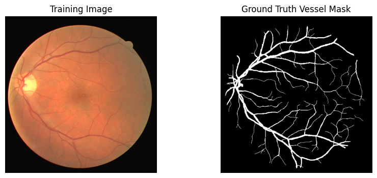
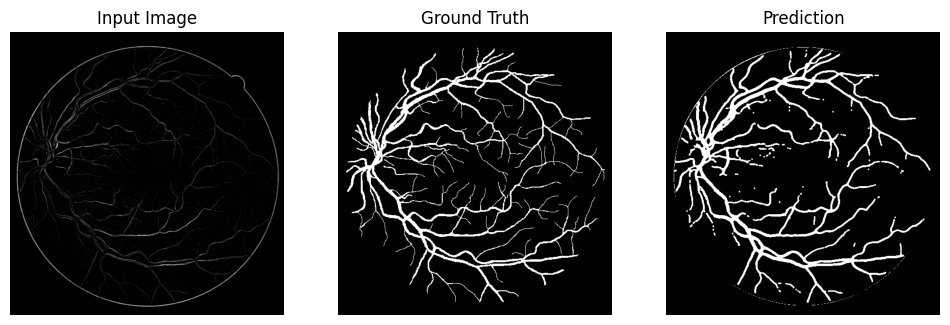

# Retinal Blood Vessel Segmentation using U-Net (DRIVE Dataset)

## Project Overview
This project implements a deep learning pipeline for **automatic retinal blood vessel segmentation** from fundus images using the **DRIVE dataset**. The goal is to accurately detect thin vascular structures that are clinically relevant for diagnosing diseases such as diabetic retinopathy, hypertension, and glaucoma.

The pipeline integrates **classical vessel enhancement techniques** with a **U-Net segmentation model** to improve vessel visibility before learning. Specifically, green channel extraction, CLAHE contrast enhancement, and Frangi filtering are applied prior to model training. Vessel-balanced patch sampling is used to address extreme foreground–background imbalance typical in retinal segmentation tasks.

The final system is trained end-to-end using a **BCE + Dice hybrid loss**, optimized for segmentation tasks with highly imbalanced classes.

---

# Dataset
The model is trained and evaluated on the **DRIVE (Digital Retinal Images for Vessel Extraction) dataset**.

- **Source:** DRIVE Retinal Vessel Segmentation Dataset  
- **Images:** 40 color fundus images  
- **Resolution:** 565 × 584 pixels  
- **Split:** 20 training images, 20 testing images  
- **Annotations:** Pixel-wise vessel segmentation masks manually annotated by experts  

The dataset also provides **Field-of-View (FOV) masks** which identify valid retinal regions. Pixels outside the retinal area are excluded during evaluation to avoid penalizing predictions on irrelevant background.

| Dataset Split | Images |
|---|---|
| Training | 20 |
| Testing | 20 |

The dataset is not included in this repository. Users must download it separately.

### Example DRIVE Image and Annotation


---

# Data Pre-Processing

Retinal vessel segmentation is challenging because vessels occupy a very small fraction of pixels (~5–10%). Several preprocessing steps are applied to improve vessel contrast before training.

### Green Channel Extraction
Fundus vessels appear most prominent in the **green channel** due to hemoglobin absorption characteristics. Therefore, only the green channel is used as model input.

```
RGB Image → Green Channel
```

### CLAHE Contrast Enhancement
Contrast Limited Adaptive Histogram Equalization (CLAHE) is applied to enhance local contrast while avoiding noise amplification.

| Parameter | Value |
|---|---|
| Clip Limit | 2.0 |
| Tile Grid Size | 8 × 8 |

This improves visibility of small vessels in low-contrast retinal regions.

### Frangi Vessel Enhancement
A **Frangi filter** is applied to emphasize tubular structures by analyzing the eigenvalues of the Hessian matrix. This filter enhances elongated vessel-like patterns while suppressing background structures.

```
CLAHE Output → Frangi Filter → Vessel Enhanced Image
```

### Vessel-Balanced Patch Sampling
Retinal images contain large background regions with no vessels. Random sampling would therefore produce mostly empty patches.

To address this, patches are sampled such that:

| Parameter | Value |
|---|---|
| Patch Size | 256 × 256 |
| Minimum Vessel Ratio | 2% |
| Max Sampling Attempts | 15 |

If a sampled patch contains fewer than 2% vessel pixels, a new patch is sampled.

### Data Augmentation
To improve generalization, the following augmentations are applied during training.

| Augmentation | Probability |
|---|---|
| Horizontal Flip | 0.5 |
| Rotation (±15°) | 0.5 |
| Random Brightness/Contrast | 0.3 |
| Gaussian Noise | 0.2 |

Albumentations is used to apply identical transformations to images and masks.

---

# Model Architecture

The segmentation model is a **U-Net**, a widely used architecture for biomedical image segmentation. It consists of an **encoder–decoder structure with skip connections** that combine high-level semantic features with fine spatial details.

```
Input (1 × 256 × 256)

Encoder
  DoubleConv(1 → 64)
  Down(64 → 128)
  Down(128 → 256)
  Down(256 → 512)
  Down(512 → 1024)

Decoder
  Up(1024 → 512)
  Up(512 → 256)
  Up(256 → 128)
  Up(128 → 64)

Output
  1 × 1 Conv → Sigmoid
```

### Double Convolution Block
Each block contains:

```
Conv2D → BatchNorm → ReLU
Conv2D → BatchNorm → ReLU
```

Batch normalization stabilizes training while ReLU introduces non-linearity.

### Skip Connections
Feature maps from encoder layers are concatenated with decoder layers to preserve fine vessel boundaries that might otherwise be lost during downsampling.

### Output Layer
A **1×1 convolution** maps the final feature map to a single channel representing vessel probability per pixel.

---

# Training Setup

| Hyperparameter | Value |
|---|---|
| Model | U-Net |
| Input Channels | 1 |
| Loss Function | BCEWithLogits + Dice Loss |
| Optimizer | Adam |
| Learning Rate | 1e-4 |
| LR Scheduler | ReduceLROnPlateau |
| Batch Size | 4 |
| Epochs | 40 |
| GPU | NVIDIA T4 (Kaggle) |

### Loss Function
A combined loss is used:

```
Loss = BCEWithLogitsLoss + DiceLoss
```

**BCE** penalizes pixel-wise classification errors, while **Dice loss** directly optimizes overlap between predicted and ground truth masks.

### Learning Rate Scheduling
`ReduceLROnPlateau` reduces the learning rate when the training loss plateaus.

| Parameter | Value |
|---|---|
| Factor | 0.5 |
| Patience | 4 epochs |

### Model Checkpointing
The best model is saved based on the **lowest training loss**.

---

# Results

Evaluation is performed on the **20 test images** of the DRIVE dataset.

During inference:

- Sigmoid probabilities are thresholded at **0.62**
- Morphological opening removes isolated false positives
- FOV masks are applied before computing metrics

### Segmentation Performance

| Metric | Value |
|---|---|
| Dice Score | **0.7208** |

### Post-processing
A **3×3 morphological opening operation** is applied to remove small noisy predictions.

```
Binary Prediction → Morphological Opening → Final Mask
```

### Qualitative Example

| Input Image | Ground Truth | Prediction |
|---|---|---|
| Retinal image | Expert annotated vessels | Model segmented vessels |

### Example Segmentation Output



---

# Key Insights

- **Green channel extraction significantly improves vessel visibility**, as retinal vasculature is most contrasted in this channel.
- **Frangi filtering provides strong structural priors** for tubular structures, making thin vessels easier for the network to learn.
- **Vessel-balanced patch sampling is essential** due to extreme class imbalance; random sampling would produce mostly empty patches.
- **Dice loss complements BCE loss** by directly optimizing the segmentation overlap metric.
- **FOV masking is necessary during evaluation**, since pixels outside the retina should not influence segmentation metrics.
- **Morphological post-processing removes isolated noise**, improving the final segmentation mask.
- The main limitation of the dataset is its **small size (20 training images)**, which restricts variability and limits generalization.
- The implemented model uses a **baseline U-Net architecture**, which is widely used for biomedical segmentation and provides strong performance on small datasets.
- Further improvements could be achieved using **advanced architectures such as Attention U-Net, Residual U-Net, or transformer-based segmentation models**, which improve feature propagation and better capture fine vascular structures.
---

# How to Run

### 1. Clone the Repository

```bash
git clone https://github.com/Gaurika-vats/Retinal-Blood-Vessel-Segmentation-using-U-Net.git
cd retinal-vessel-segmentation
```

### 2. Install Dependencies

```bash
pip install -r requirements.txt
```

### 3. Download the Dataset

Download the **DRIVE dataset** and place it in the following structure:

```
DRIVE/
   training/
       images/
       1st_manual/
   test/
       images/
       1st_manual/
       mask/
```

Update `base_path` in the script if necessary.

### 4. Train the Model

Run the training notebook or script.

The best model checkpoint will be saved as:

```
best_unet_drive_model.pth
```

### 5. Evaluate the Model

Load the checkpoint and run the evaluation section of the notebook to compute the Dice score and visualize predictions.

```python
model.load_state_dict(torch.load("best_unet_drive_model.pth"))
model.eval()
```

---

**Environment**

- Python 3.10+
- PyTorch
- Albumentations
- OpenCV
- scikit-image

Training and evaluation were performed on a **Kaggle environment with NVIDIA T4 GPU**.
